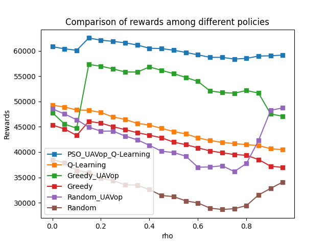
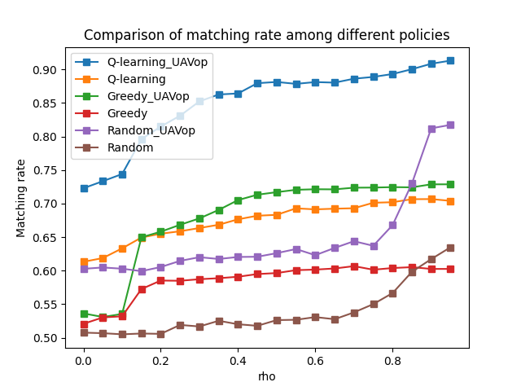
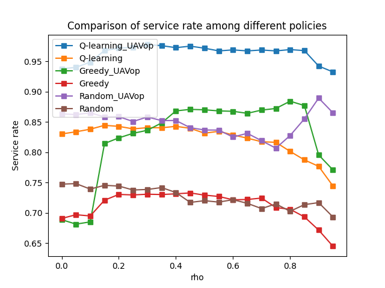
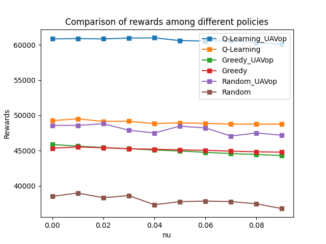
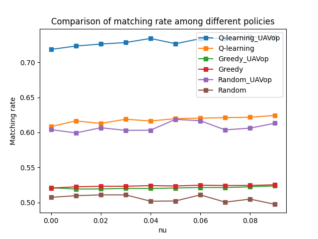
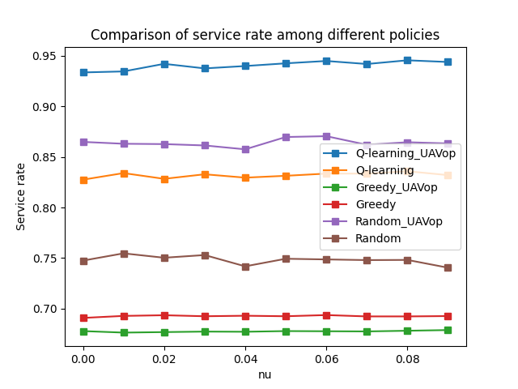

# Semantic-Aware Blockchain Metaverse

Python code for the paper **"Semantic-Aware Blockchain Architecture Design for Edge-enabled Metaverse"** by Ning Wang and Beatriz Lorenzo (University of Massachusetts Amherst), IEEE, 2023.

Metaverse users generate computing tasks with different **semantic types**. Each type has its own price, delay requirement and throughput requirement. A swarm of **UAV edge servers** collects the tasks and runs a **consortium blockchain** that decides which UAV computes each task. The code solves two problems:

| Problem | What is optimized | Method | File |
|---|---|---|---|
| **P1**: UAV deployment | UAV positions that maximize the average A2G + A2A throughput (Eq. 6, 9) | Particle Swarm Optimization (PSO) | `UAV_deployment.py` |
| **P2**: Task allocation | Task-to-server assignment that maximizes blockchain profit under semantic-mismatch penalties (Eq. 7, 8, 10) | Q-learning (ε-greedy), compared with greedy and random selection | `task_allocation.py` |

## Workflow

1. **Task generation and semantic classification.** 60 tasks of K = 4 semantic types are generated, along with 20 UAV servers of the same 4 types.
2. **User–UAV binding.** Each user is bound to its closest UAV, which acts as its trusted server.
3. **UAV deployment (P1).** PSO moves each UAV to maximize the average throughput of its A2G links (to its users) and A2A links (to the other UAVs).
4. **Task allocation (P2).** The blockchain assigns each task to a server for local computing or offloading. Semantic mismatches are penalized by the computing penalty **ρ** and the communication penalty **ν**.
5. **Evaluation.** The total reward, the task–server **matching rate** and the **service rate** (the share of tasks served within their requirements) are recorded for each value of ρ or ν.

## Results

Computing penalty ρ (Fig. 3 in the paper):

| Rewards | Matching rate | Service rate |
|---|---|---|
|  |  |  |

Communication penalty ν (Fig. 4 in the paper):

| Rewards | Matching rate | Service rate |
|---|---|---|
|  |  |  |

Q-learning with PSO-optimized UAV positions gives the highest reward. The reward peaks around ρ = 0.15 and ν = 0.04.

## Repository structure

```
├── run_experiment.py                        # entry point: runs the ρ / ν sweeps and saves CSV results
├── task_generation.py                       # semantic tasks: type, price, data size, delay/throughput requirements, bandwidth
├── server_generation.py                     # UAV servers: type, computing resource, CPU parameters, location, Tx powers
├── binding_and_A2G_communication_model.py   # user–UAV binding and A2G channel rates (Eq. 1–3)
├── A2A_model_get_rate.py                    # A2A channel rates between UAVs (Eq. 4–5)
├── UAV_deployment.py                        # PSO for UAV positioning (P1, Algorithm 1)
├── task_allocation.py                       # rewards, Q-learning, greedy and random allocation (P2, Algorithm 2)
├── figures/                                 # result figures used in the paper
└── test_values/                             # raw simulation results (one CSV per seed and penalty value)
    ├── with_UAV_optimize/{rho,nu}/
    └── no_UAV_optimize/{rho,nu}/
```

## Requirements

- Python 3.9 or 3.10 (the results were produced with Python 3.9)
- `numpy < 2` and `pandas < 2`

```bash
pip install -r requirements.txt
```

`task_allocation.py` updates its tables with chained assignment (`table[col][row] = value`). Under the Copy-on-Write default of pandas 3.x those updates are silently dropped, so use a pandas version below 2.

## Quick start

```bash
# Q-learning with PSO-optimized UAV positions, sweep the computing penalty rho (Fig. 3)
python run_experiment.py --sweep rho

# Same, but sweep the communication penalty nu (Fig. 4)
python run_experiment.py --sweep nu

# Baselines without UAV position optimization
python run_experiment.py --sweep rho --no-uav-opt
python run_experiment.py --sweep nu --no-uav-opt

# A quick run: one seed and two penalty values, written to a custom folder
python run_experiment.py --sweep rho --seeds 0 --values 0 0.15 --out-dir results/
```

The paper averages 100 independent simulations (seeds 0–99, e.g. `--seeds $(seq 0 99)`). By default, seeds 0–9 are run and results are written to `test_values/<with|no>_UAV_optimize/<rho|nu>/` as `UAV_dp_seed_<seed>_<sweep>_<value>.csv` (or `UAV_no_dp_...` without PSO). Each CSV holds one row with the parameters and, for Q-learning, greedy and random selection, the maximum reward, the allocation, the matching rate, the service rate and the unserved tasks.

The PSO step is much slower than the allocation step. Use `--no-uav-opt` for quick checks.

## Key simulation parameters

| Parameter | Value |
|---|---|
| Map size | 200 m × 200 m |
| Tasks / UAV servers / semantic types | 60 / 20 / 4 |
| Task data size | 20–30 Mbit |
| Bandwidth per task type | 5, 25, 50, 100 MHz |
| Delay / throughput requirement per type | 40 ms, 1 Mbit/s; 10 ms, 5 Mbit/s; 60 ms, 10 Mbit/s; 15 ms, 20 Mbit/s |
| Carrier frequency, UAV altitude | 2.5 GHz, 50 m |
| A2G channel (urban) a, b, η_LoS, η_NLoS | 9.61, 0.16, 1, 20 |
| Intermediary fee ratio λ | 0.1 |
| Mismatched-resource ratio δ | 0.3 |
| ρ sweep / ν sweep | 0–0.95 (step 0.05) / 0–0.09 (step 0.01) |
| Q-learning episodes | 500 |
| PSO swarm size, iterations, w, w_damp, c1, c2 | 50, 100, 1, 0.98, 1.5, 1.5 |

## Citation

If you use this code, please cite:

```bibtex
@inproceedings{wang2023semantic,
  author    = {Wang, Ning and Lorenzo, Beatriz},
  title     = {Semantic-Aware Blockchain Architecture Design for Edge-enabled Metaverse},
  year      = {2023},
  publisher = {IEEE}
}
```

## Acknowledgements

This work is partially supported by the US National Science Foundation under Grant CNS-2008309.

## License

Released under the MIT License.
